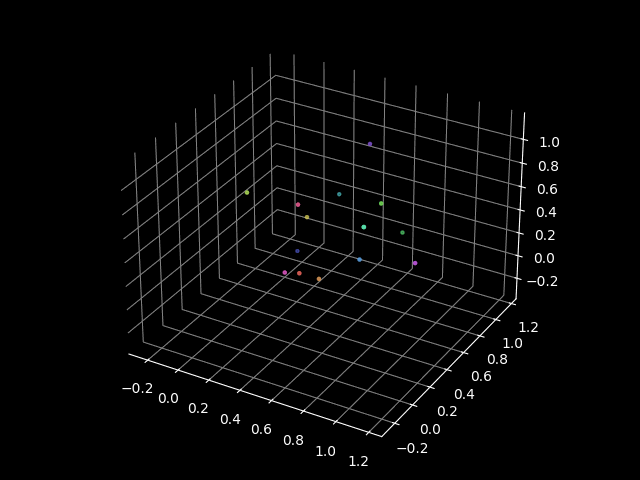

# Parallel n-body simulation



```
python3 gen.py
./run1.sh
./run2.sh
python3 test.py
./run3.sh
python3 visualize.py
```

## TODO

- why `(p+1)//2`
- use `dtype` everywhere

## Lessons Learned

### Communication

- `send` + `recv` &rarr; `UnpickleError`
- `send` + `Recv` &rarr; non-compatible due to different protocol
- `Send` + `Recv` &rarr; blocks for large payloads
- `Isend` + `Recv` + single `np.array` &rarr; Recv overwrites Isend array
- `Isend` + `Recv` + double buffering &rarr; works like charm

### Flags

- `--use-hwthread-cpus`
- `--oversubscribe`

### Floating point arithmetic

- `np.isclose(rtol=..., atol=...)`
- RuntimeWarning: invalid value encountered in true_divide
